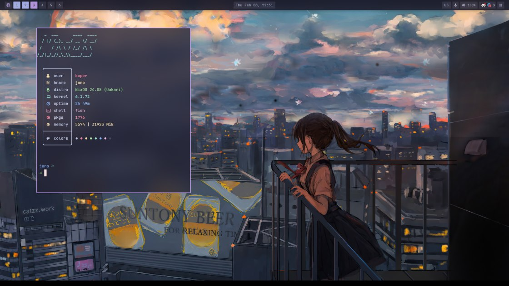

<h1 align="center"> Its Just my sweety config for  <code>NixOS❄️</code> </h1>

  
   

###

<h1 align="left"> :blue_book: About</h1> 

 

 - OS: [**`NixOS`**](https://nixos.org/)
 - WM - [**`awesomeWM`**](https://awesomewm.org/);
 - Editor [**`Neovim`**](https://neovim.io/)
 - Bar - [**`Wibox`**](https://awesomewm.org/);
 - X Compositor [**`Compfy`**](https://github.com/allusive-dev/compfy);
 - Terminal - [**`Kitty`**](https://sw.kovidgoyal.net/kitty/);
 - Shell - [**`Fish`**](https://fishshell.com/);
 - Promt - [**`Statship`**](https://starship.rs/);

 

## 💻 HotKeys
* **Open the terminal** - `super + return`
* **Switch the to float** - `ctrl + super + space`
* **Open the application menu** - `super + d`
* **Lock the screen** - `super + l`
* **Close the window that is in focus** - `super + c`
* **Take a screenshot** - `print`
* **Switch to another desktop** - `super + 1/6`
* **Move the window to another desktop** - `super + shift + 1/6`
*  **Restart awesomeWM** - `ctrl + super + r`

#

WM config in [`awesomeWM branch`](https://github.com/SHTRAMPANTUNC/MyNixOS/tree/awesomeWM)

Also see [`MyNvim config`](https://github.com/SHTRAMPANTUNC/MyNvim)
