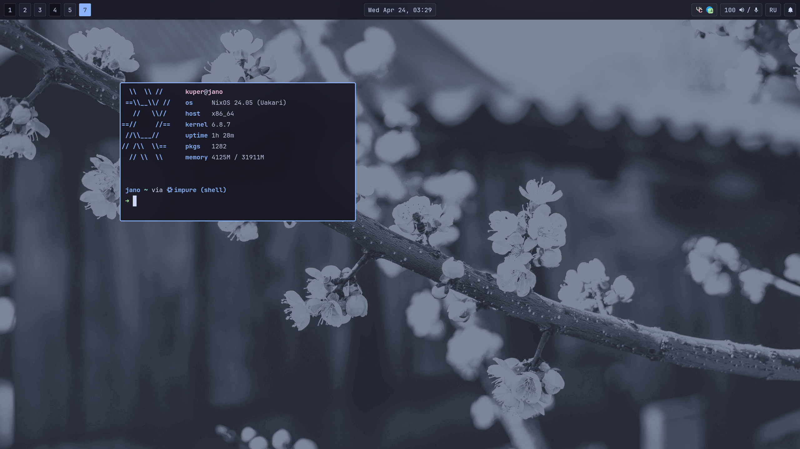

<h1 align="center"> Its Just my sweety config for  <code>NixOS❄️</code> </h1>

  
   

###

<h1 align="left"> :blue_book: About</h1> 

 

 - OS- [**`NixOS`**](https://nixos.org/)
 - WM - [**`Hyprand`**](https://hyprland.org/)
 - Editor - [**`Neovim`**](https://neovim.io/)
 - Bar - [**`Waybar`**](https://github.com/Alexays/Waybar)
 - Terminal - [**`Foot`**](https://codeberg.org/dnkl/foot)
 - Shell - [**`Fish`**](https://fishshell.com/)
 - Promt - [**`Statship`**](https://starship.rs/)

 

## 🖼️ Gallery

## 💻 HotKeys
| Keys        | Function          |
| ------------- |-------------|
| <kbd>SUPER</kbd> <kbd>SHIFT</kbd> <kbd>c</kbd>  | Kill Active Window |
| <kbd>SUPER</kbd> <kbd>f</kbd> | Toggle FullScreen |
| <kbd>SUPER</kbd> <kbd>Space</kbd> | Toggle Floating |
| <kbd>SUPER</kbd> <kbd>j</kbd> / <kbd>k</kbd> | Move Focus prev/next |
| <kbd>SUPERSHIFT</kbd> <kbd>j</kbd> / <kbd>k</kbd> | Move Window prev/next |
| <kbd>SUPER</kbd> <kbd>Return</kbd> | Open Terminal |
| <kbd>Print</kbd> | Screenshot |
| <kbd>SUPER</kbd> <kbd>p</kbd>| [Color Picker](https://github.com/hyprwm/hyprpicker) |
| <kbd>SUPER</kbd> <kbd>n</kbd> | [Swaync](https://github.com/ErikReider/SwayNotificationCenter) |
| <kbd>SUPER</kbd> <kbd>d</kbd> | [Rofi](https://github.com/davatorium/rofi) |
| <kbd>SUPER</kbd> <kbd>v</kbd> / <kbd>Shift + v</kbd> | Change Volume +/- |
| <kbd>SUPER</kbd> <kbd>m</kbd> | Mute Microphone |
| <kbd>SUPERSHIFT</kbd> <kbd>s</kbd> | Resize Mode |
| <kbd>SUPERSHIFT</kbd> <kbd>l</kbd> /<kbd>h</kbd> /<kbd>j</kbd> /<kbd>k</kbd> | Resize Window Right/Left/Up/Down |

#

Also see [`MyNvim config`](https://github.com/SHTRAMPANTUNC/MyNvim)
